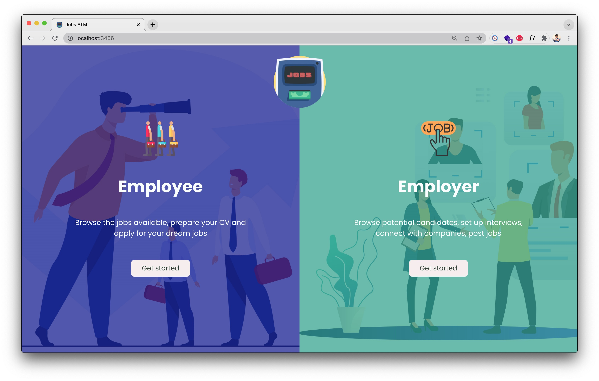

# Jobs ATM

## About this project

Jobs ATM is a full-fledge, fullstack application that allows job-seekers and recruiters to connect with each other. It's the personal project of Hoang Nguyen.

The core of this app is built with React and Spring Boot. I chose to go with the MVC design for this project as it is a modern and highly scalable architecture. Other technologies involved are Redis for caching and Kafka for message queue. 

However, as the 2-day time allowance was so limited, a lot of improvements could have been made. I'm not satisfied with what I was able to put in this project in such limited time and thus this project does NOT reflect truly my potential and should not be considered accordingly.

## Deployment
The frontend of this project can be viewed here: https://hoangdesu.github.io/Jobs-ATM/

## Port configs

- Spring port: 8910
- React port: 3456
- Postgres port: 5678

## Backend
- Postgres: create database `jobsatm`

